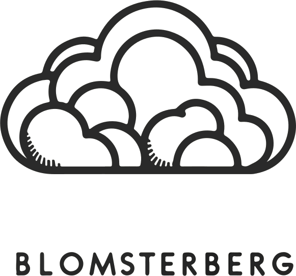
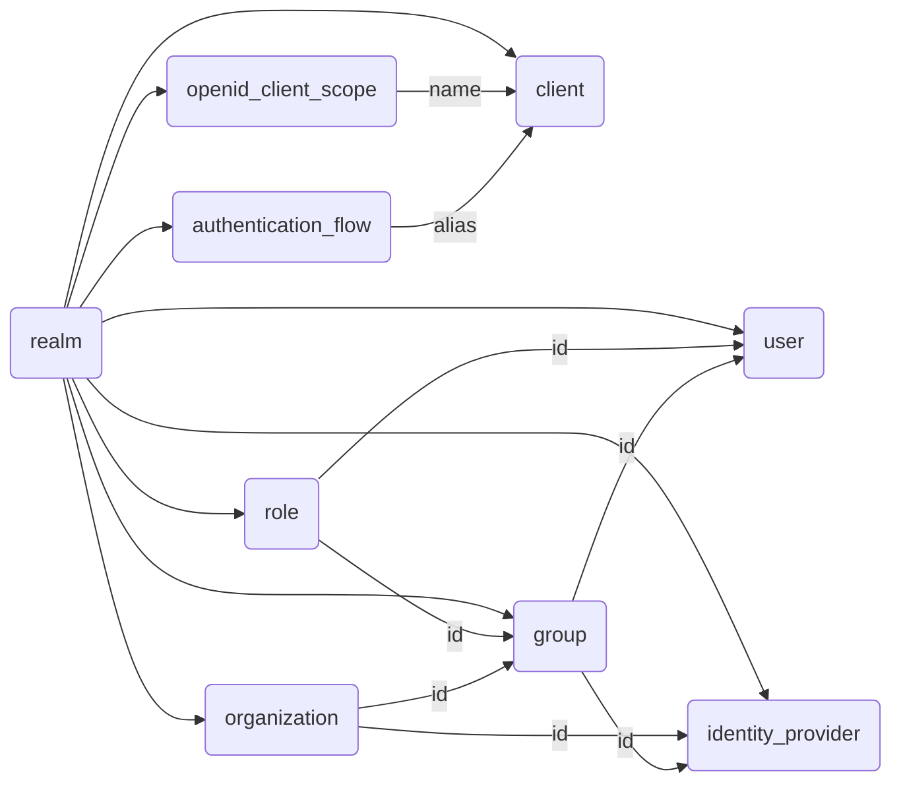

<br />

<div id="readme-top" align="center">
  <a href="https://github.com/mBlomsterberg/">
    <picture>
      <source srcset="logo_inv.png" media="(prefers-color-scheme: dark)">
      
    </picture>
  </a>

  <h3 align="center">terraform-keycloak-modules</h3>

  <p align="center">
    A collection of reusable Terraform modules for managing Keycloak resources.
    <br />
    <br />
    <a href="documentation/module-overview.md">Module Overview</a>
    ·
    <a href="documentation/module-composition.md">Composition Guide</a>
    ·
    <a href="documentation/terraform-client-setup.md">Provider Setup</a>
  </p>
  <br />
</div>

<div align="center">


</div>
<br>

# About

This repository provides a collection of standalone Terraform modules for managing Keycloak resources. Each module manages one logical Keycloak concept and exposes outputs that downstream modules consume as inputs, allowing you to compose a complete realm configuration from small, reusable building blocks.

Requires **Terraform ≥ 1.0** and **keycloak provider ≥ 5.7.0**.

# Modules

| Module | Description |
| ------ | ----------- |
| [`realm`](modules/realm/) | Manages a Keycloak realm and its event configuration |
| [`authentication_flow`](modules/authentication_flow/) | Custom authentication flows, executions, execution configs, and subflows |
| [`openid_client_scope`](modules/openid_client_scope/) | OpenID Connect client scopes and protocol mappers |
| [`client`](modules/client/) | OpenID Connect clients and their scope assignments |
| [`role`](modules/role/) | Realm roles and client-scoped roles, including composite roles |
| [`group`](modules/group/) | Groups with role assignments, user memberships, and fine-grained permissions |
| [`organization`](modules/organization/) | Organizations (Keycloak 26+) with email domain associations |
| [`identity_provider`](modules/identity_provider/) | Identity providers and attribute/role/group mappers; sub-modules for Google, GitHub, Microsoft, and SAML |
| [`user`](modules/user/) | Users with initial password, federated identities, group membership, and role assignments |

Every module ships a **wrapper** at `wrappers/<plural>/` that accepts an `items` map to create many instances in a single call.

# Dependency graph



All modules except `realm` also take `realm.id` as `realm_id` — that edge is omitted to reduce clutter.

# Quick start

## 1. Start local Keycloak

```sh
docker compose up --build -d
```

Wait until Keycloak is healthy:

```sh
curl -s http://localhost:9000/health/ready
# {"status":"UP", ...}
```

## 2. Configure the provider

```hcl
terraform {
  required_providers {
    keycloak = {
      source  = "keycloak/keycloak"
      version = ">= 5.7.0"
    }
  }
}

provider "keycloak" {
  client_id     = "terraform"
  client_secret = var.keycloak_client_secret
  url           = "http://localhost:8080"
}
```

See [documentation/terraform-client-setup.md](documentation/terraform-client-setup.md) for how to create the `terraform` service-account client in Keycloak.

## 3. Use a module

```hcl
module "my_realm" {
  source = "path/to/modules/realm"

  realm        = "my-realm"
  display_name = "My Realm"
  ssl_required = "all"
}

module "my_client" {
  source = "path/to/modules/client"

  realm_id            = module.my_realm.id
  client_id           = "my-app"
  access_type         = "CONFIDENTIAL"
  valid_redirect_uris = ["https://app.example.com/*"]
}
```

For a full wiring example that touches every module, see [documentation/module-composition.md](documentation/module-composition.md).

# Documentation

| Document | Description |
| -------- | ----------- |
| [Module overview](documentation/module-overview.md) | Resources, key inputs/outputs, and dependencies for each module |
| [Composition guide](documentation/module-composition.md) | End-to-end example wiring all modules together |
| [Provider setup](documentation/terraform-client-setup.md) | Creating the Keycloak service-account client for Terraform |

# Contact

**Github** [mBlomsterberg](https://github.com/mBlomsterberg)

**Linkedin** [Mikkel Blomsterberg](https://www.linkedin.com/in/mikkel-blomsterberg-663b785a/)

# Contributing

Contributions are welcome. Please read [CONTRIBUTING.md](CONTRIBUTING.md) before opening a pull request.

# License

Copyright (c) Mikkel Blomsterberg. All rights reserved.

Licensed under the MIT license.

<p align="right">(<a href="#readme-top">back to top</a>)</p>
